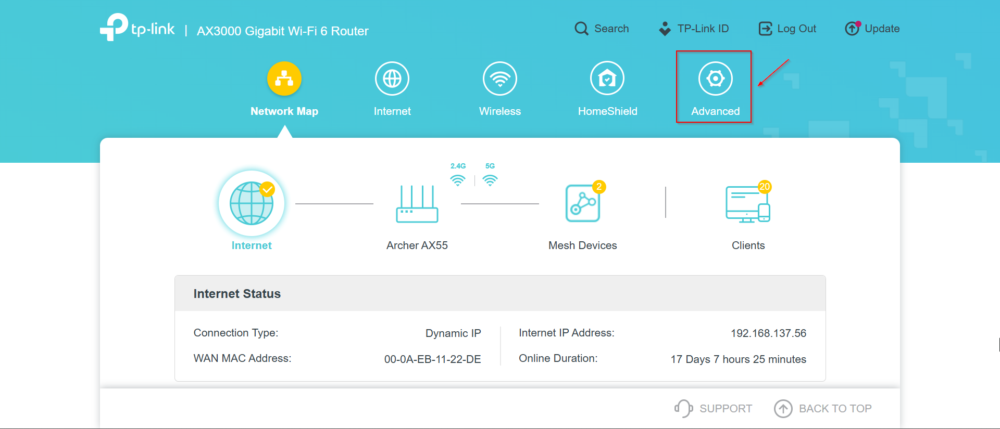
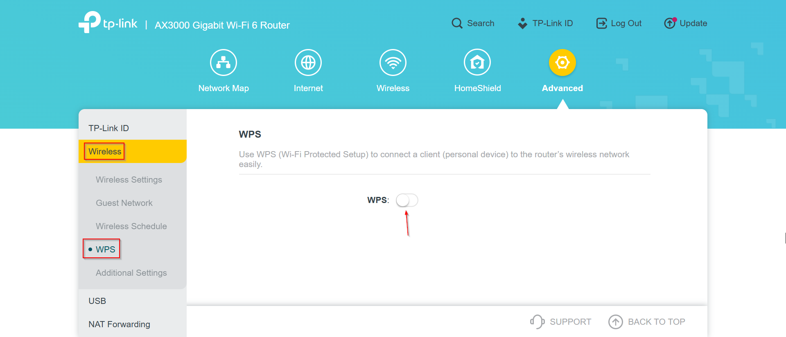
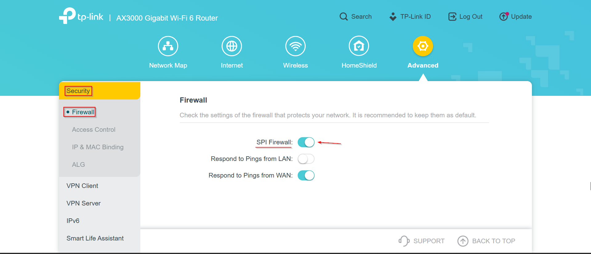
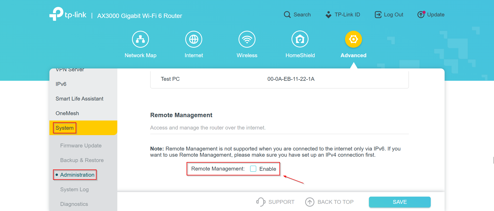
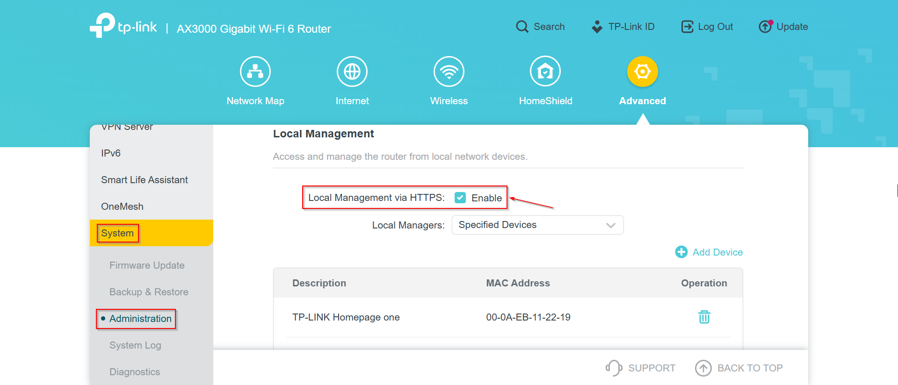
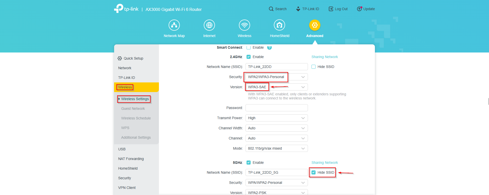
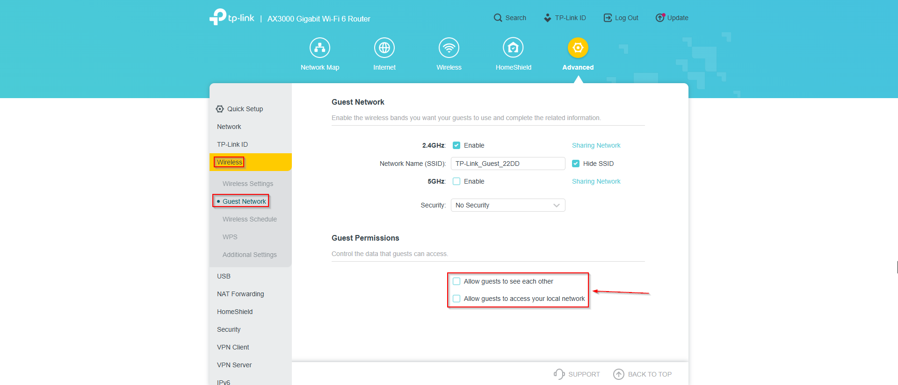
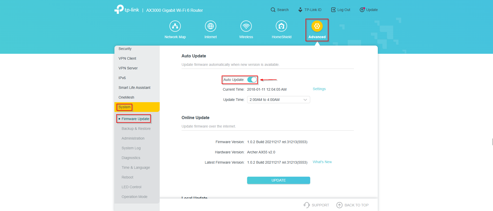

# Guía de Hardening: TP-Link Archer AX55 (V2)

Alumno/a: Iván Paúl Alba  
Asignatura: Bastionado de Redes y Sistemas  
Fecha: 21/04/2026  
Dispositivo: TP-Link Archer AX55  
Versión de hardware: V2  
Emulador: https://emulator.tp-link.com/webpages_ax55v2_emulator/#networkStatus

---

## Índice

1. [Introducción](#introduccion)
2. [Entorno de trabajo](#entorno)
3. [Configuración inicial observada](#configuracion-inicial)
4. [Tabla de medidas aplicadas](#tabla-medidas)
5. [Hardening paso a paso con evidencias](#hardening-pasos)
6. [Limitaciones detectadas](#limitaciones)
7. [Análisis crítico](#analisis-critico)
8. [Conclusión (punto crítico)](#conclusion)
9. [Anexo: Comparación con guía externa](#anexo)
10. [Referencias](#referencias)

---

## 1. Introducción

He elegido el TP-Link Archer AX55 (V2) porque es un router actual con WiFi 6, y eso permite aplicar medidas de seguridad modernas de forma realista para esta práctica. Aunque sea un equipo doméstico, incluye opciones importantes como gestión segura, red de invitados y control de firewall, así que me parece una buena base para aprender hardening paso a paso.

## 2. Entorno de trabajo

Para realizar esta guía he utilizado como base el recurso de RouterSecurity y el emulador oficial del TP-Link Archer AX55 V2. Las pruebas se han hecho desde navegador web sobre el entorno de simulación, tomando capturas en cada cambio importante para dejar evidencia del hardening aplicado.

## 3. Configuración inicial observada

### 3.1 Estado inicial (antes del hardening)

En el estado inicial observé que había apartados de seguridad correctos y otros que necesitaban revisión. El panel permitía revisar la gestión segura, pero WPS aparecía como una función con riesgo y la separación de la red de invitados no quedaba clara al principio. El firewall SPI estaba disponible, aunque la gestión remota y la parte de autoactualización del firmware necesitaban comprobación manual.

### 3.2 Riesgos detectados inicialmente

Los riesgos iniciales más importantes fueron claros: tener WPS activo aumenta mucho la exposición frente a ataques automatizados, dejar abierta la gestión remota facilita intentos de acceso desde Internet y no aislar bien la red de invitados puede permitir que un dispositivo externo llegue a la red interna. Además, si el firmware no se mantiene al día, pueden quedar vulnerabilidades conocidas sin corregir.

---

## 4. Tabla de medidas aplicadas

| Medida | Qué hice | Por qué importa | Estado |
|---|---|---|---|
| Medida 1: Gestión por HTTPS | Revisé la administración para priorizar acceso seguro y evitar gestión abierta | Protege mejor el acceso al panel de configuración | Aplicada |
| Medida 2: Desactivación de WPS | Apagué WPS desde Wireless > WPS | Evita una vía de ataque muy común en routers domésticos | Aplicada |
| Medida 3: Aislamiento de red de invitados | Activé red de invitados y bloqueé acceso a red local | Evita que invitados entren a equipos internos | Aplicada |
| Medida 4: Firewall SPI activado | Verifiqué que el firewall estuviera en Enabled | Bloquea conexiones entrantes no esperadas | Aplicada |

---

## 5. Hardening paso a paso con evidencias

### Paso 1. Entrada al panel avanzado

Para empezar el hardening, fui directamente a la pestaña **Advanced**, ya que ahí están las opciones importantes de seguridad.

### Paso 2. Desactivar WPS

En la ruta Wireless > WPS dejé esta función en OFF. Aunque WPS es cómodo para conectar dispositivos rápido, también representa un riesgo innecesario, por lo que en una configuración segura lo recomendable es mantenerlo desactivado. El cambio se aplicó correctamente.

### Paso 3. Activar y revisar firewall SPI

Después entré en Security > Firewall y verifiqué que SPI Firewall quedara en Enabled. Esta medida es importante porque ayuda a bloquear conexiones entrantes que no han sido solicitadas por los equipos de la red interna. La comprobación fue correcta.

### Paso 4. Gestión segura del panel de administración

En System > Administration desactivé la opción de Remote Management y revisé que el acceso al panel se hiciera de forma segura. Este punto me parece clave, porque al quitar la gestión remota se reduce mucho la posibilidad de que alguien intente atacar el router desde fuera de la red local. El resultado fue correcto.

### Paso 5. Hardening básico del WiFi

En Wireless > Wireless Settings mantuve una configuración de cifrado fuerte, priorizando WPA3 cuando estaba disponible y, en su defecto, WPA2-PSK con AES. También revisé la opción de ocultar SSID para no dejar la red tan visible a simple vista. Con esto, la protección del acceso WiFi mejora de forma notable. El resultado fue correcto.

### Paso 6. Red de invitados aislada

En Wireless > Guest Network activé la red de invitados y deshabilité su acceso a la red local. Esta separación es muy útil porque evita que un dispositivo invitado pueda interactuar con ordenadores o recursos internos. La medida quedó aplicada correctamente.

### Paso 7. Actualización de firmware

Por último, en Advanced > System > Firmware Update revisé la parte de actualizaciones y la importancia de mantener Auto-Update cuando sea posible. Este paso es fundamental porque una buena configuración puede quedarse corta si el firmware tiene fallos sin corregir. El apartado quedó revisado.

---

## 6. Limitaciones detectadas

Después de hacer el hardening, el TP-Link Archer AX55 mejora bastante, pero sigue siendo un router doméstico. Se puede dejar más seguro para casa o una red pequeña, pero no llega al nivel de gestión de un entorno profesional completo.

La principal limitación es que no tiene un controlador centralizado como el ecosistema de Ubiquiti que se pide en la Parte 2 del proyecto. Eso significa que no puedo gestionar varios puntos de acceso de forma unificada, con la misma comodidad y control que tendría en una red empresarial.

---

## 7. Análisis crítico

### Fortalezas

Como punto fuerte, el hardening aplicado reduce fallos muy comunes en routers domésticos y deja una base de seguridad bastante más sólida que la configuración inicial. Además, son cambios que se pueden repetir fácilmente y quedan bien justificados dentro de la práctica.

### Debilidades

La principal debilidad es que algunas funciones avanzadas no están al nivel de equipos empresariales. También influye mucho el mantenimiento: si no se revisa firmware o se modifican ajustes sin control, la seguridad puede bajar con el tiempo.

### Riesgo residual

Aunque el resultado es bueno, siempre queda cierto riesgo residual, sobre todo si aparece una vulnerabilidad nueva del fabricante o si no se hace seguimiento periódico de la configuración.

---

## 8. Conclusión (punto crítico)

La frase del proyecto se cumple totalmente: **"El mayor experto del mundo solo puede hacer un router seguro tanto como lo permita su firmware"**. En esta práctica he securizado el TP-Link con medidas importantes y reales, pero aun así no deja de ser un router doméstico.

Aunque la mejora es clara, sigue faltando nivel empresarial en funciones como detección avanzada de amenazas y gestión centralizada de varios equipos. Por eso, si la red va a manejar datos muy sensibles, mi recomendación sería dar el salto a una solución tipo Ubiquiti, como plantea el proyecto.

---

## 9. Anexo: Comparación con guía externa

Para completar la práctica, revisé una guía de seguridad ya publicada en RouterSecurity (Michael Horowitz), que propone una lista corta de medidas para routers domésticos y compara muy bien lo mínimo que deberíamos aplicar siempre.

### 9.1 Qué coincide con lo que ya hice

La guía externa coincide bastante con mi trabajo, especialmente en desactivar WPS, revisar la gestión remota para dejarla desactivada, usar cifrado WiFi fuerte, separar la red de invitados y revisar el firmware de forma periódica.

### 9.2 Crítica a medidas que se suelen sobrevalorar

También saqué una conclusión importante: hay medidas que ayudan, pero a veces se venden como si fueran la solución total y no lo son. Por ejemplo, ocultar el nombre de la red puede poner una pequeña barrera, pero no evita por sí solo un ataque serio. Tener el firewall activado es obligatorio, pero tampoco convierte un router doméstico en un sistema profesional. Y decir solamente "uso WPA2" se queda corto si no se comprueba que sea con AES y con una clave realmente robusta.

### 9.3 Medidas nuevas que añadiría al hardening

Como mejora adicional, añadiría desactivar UPnP cuando no se necesite, revisar que no existan reglas de Port Forwarding o DMZ abiertas sin motivo, reforzar el usuario y la contraseña de administración con una combinación única, usar una clave WiFi larga no reutilizada y guardar una copia de seguridad de la configuración final. También considero buena práctica revisar cada cierto tiempo la lista de dispositivos conectados para detectar equipos desconocidos.

### 9.4 Valoración final del anexo

Mi conclusión es que el hardening que hice va por buen camino, pero para que sea realmente sólido hay que mantenerlo en el tiempo y añadir estas medidas extra. En resumen: no basta con dejar el router "bien configurado" una vez; hay que revisarlo y cuidarlo como parte de la seguridad diaria.

---

## 10. Referencias

https://routersecurity.org/resources.php  
https://routersecurity.org/  
https://routersecurity.org/checklist.php  
https://emulator.tp-link.com/webpages_ax55v2_emulator/#networkStatus