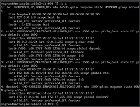

# A12. Identificación de sistemas con NMAP

### a) Identifica la IP del equipo objetivo.

### b) Identifica Sistema operativo.

### c) Identifica puertos/servicios abiertos (TCP / UDP).

### d) Identifica versiones de los servicios detectados.

### e) Comprueba si existen usuarios con contraseñas vacías (NSE).

### f) Comprueba las vulnerabilidades existentes en el equipo (NSE).

### g) Comprueba si dispone de servicios web habilitados (NSE).

### h) Ejecuta los scripts por defecto de nmap para ampliar la información (NSE).

### i) Cualquier otra información que consideres relevante de incorporar en el informe.

### j) Realizar un informe técnico describa toda la información recopilada durante la realización del escáner manual.